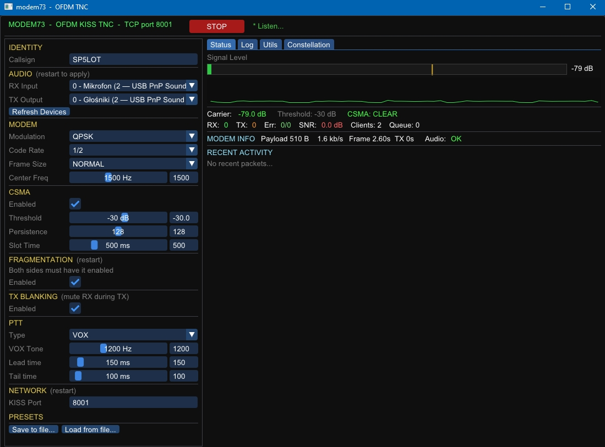

  <picture>
    <source media="(prefers-color-scheme: dark)" srcset="https://i.ibb.co/LDNR23jg/MODEM73-white.png">
    <source media="(prefers-color-scheme: light)" srcset="https://i.ibb.co/wZKznzrF/MODEM73-blk.png">
    
  </picture>

**MODEM73** is a [KISS](https://en.wikipedia.org/wiki/KISS_(amateur_radio_protocol)) TNC frontend for the [aicodix](https://github.com/aicodix/modem) OFDM modem — now with a native **Windows GUI**.

> This is a fork of [RFnexus/modem73](https://github.com/RFnexus/modem73) adding a native Windows GUI and pre-built Windows binaries.
> All credit for the original modem73 TNC goes to [RFnexus](https://github.com/RFnexus). Many thanks!

---

## Windows GUI — Download & Run

📥 **[Download modem73_gui_windows.zip from Releases](../../releases)**

1. Unzip to any folder
2. Run `modem73_gui.exe` — no installation, no MSYS2 required
3. Settings are saved automatically between sessions

Full documentation:
- 🇬🇧 [Windows GUI User Guide (English)](WINDOWS_GUI.md)
- 🇵🇱 [Podręcznik Windows GUI (Polski)](WINDOWS_GUI_PL.md)

---

## What is modem73?

modem73 is a software TNC that uses OFDM modulation to send and receive digital data over any SSB or FM transceiver using a standard PC sound card or USB audio interface. It speaks the [KISS](https://en.wikipedia.org/wiki/KISS_(amateur_radio_protocol)) protocol over TCP, making it compatible with:

- **[Reticulum](https://reticulum.network)** mesh networking — [MeshChat](https://github.com/liamcottle/reticulum-meshchat), [MeshChatX](https://git.quad4.io/RNS-Things/MeshChatX), [Sideband](https://github.com/markqvist/Sideband)
- **APRS** software — Dire Wolf, Xastir, YAAC
- **Winlink** — Pat
- Any KISS-capable packet radio application

All modes require 2400 Hz of audio bandwidth and work over both SSB and FM.

---

## License

modem73 is open-source. See [LICENSE](LICENSE) for details.
